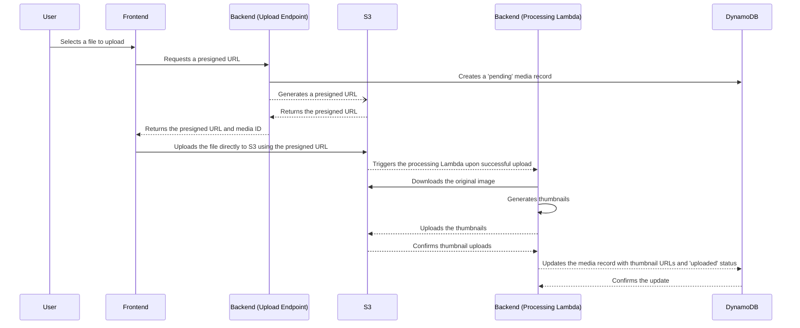

# Media Upload Flow

This document describes the complete media upload flow for the PornSpot.ai application, from the frontend to the final processing and storage in S3.

## Upload Flow Diagram

## Backend Implementation

### 1. **Presigned URL Generation**

- **Endpoint**: `POST /albums/{albumId}/media/upload`
- **Handler**: [`backend/functions/media/upload.ts`](../backend/functions/media/upload.ts)
- **Process**:
  1.  The frontend sends a request with the filename, MIME type, and size of the file to be uploaded.
  2.  The backend verifies that the album exists.
  3.  A new media record is created in DynamoDB with a `pending` status.
  4.  A presigned URL is generated using the AWS S3 SDK. This URL grants the frontend temporary permission to upload a file directly to our S3 bucket.
  5.  The presigned URL and the new media ID are returned to the frontend.

### 2. **Media Processing**

- **Trigger**: An S3 event is configured to trigger a Lambda function whenever a new object is created in the `media/` directory of the S3 bucket.
- **Lambda Handler**: [`backend/functions/media/process-upload.ts`](../backend/functions/media/process-upload.ts)
- **Process**:
  1.  The Lambda function is triggered by the S3 event.
  2.  It downloads the original image from S3.
  3.  It uses the **Sharp** library to generate multiple thumbnail sizes (see [`THUMBNAIL_SYSTEM.md`](THUMBNAIL_SYSTEM.md) for details).
  4.  The generated thumbnails are uploaded to the `thumbnails/` directory in the same S3 bucket.
  5.  The media record in DynamoDB is updated with the URLs of the thumbnails and the status is changed to `uploaded`.

## Frontend Implementation

### 1. **File Selection**

- The user selects a file to upload using a file input or a drag-and-drop component.

### 2. **Requesting the Presigned URL**

- The frontend sends a request to the backend's upload endpoint with the file details.

### 3. **Uploading to S3**

- The frontend receives the presigned URL and media ID from the backend.
- It then uses the presigned URL to upload the file directly to S3 using a `PUT` request. This is done on the client-side, so the file does not pass through our backend servers.
- An `onUploadProgress` handler is used to display the upload progress to the user.

### 4. **Handling the Upload Completion**

- Once the upload to S3 is complete, the frontend can either poll the API to check the status of the media item, or it can be updated via a real-time mechanism like WebSockets (if implemented). The current implementation relies on the user refreshing the page or navigating to the album to see the new media.

## Error Handling

- **Upload to S3 Fails**: If the upload to S3 fails, the frontend should notify the user and provide an option to retry.
- **Processing Fails**: If the backend processing fails, the media record in DynamoDB will remain in a `pending` state or be marked as `failed`. A separate clean-up process can be implemented to handle these failed uploads.
