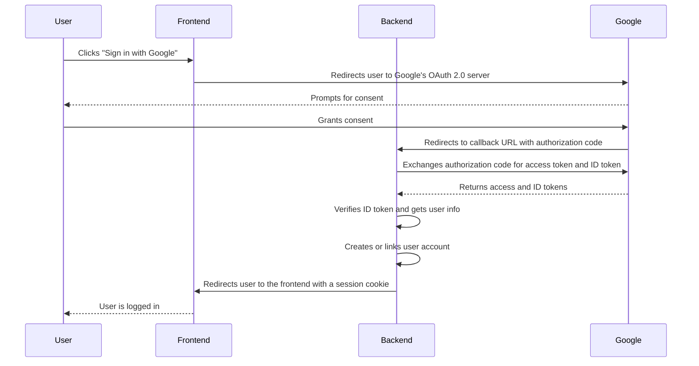

# Google OAuth 2.0 Integration

This document provides a detailed overview of the Google OAuth 2.0 integration for the PornSpot.ai application.

## OAuth Flow

The application uses the OAuth 2.0 Authorization Code Flow to authenticate users with their Google accounts.

## Backend Implementation

### OAuth Callback Handler

- **Endpoint**: `GET /auth/oauth/callback`
- **Handler**: [`backend/functions/user/auth/oauth-google.ts`](../backend/functions/user/auth/oauth-google.ts)
- **Process**:
  1.  **Authorization Code Exchange**: The backend receives the authorization code from Google and exchanges it for an access token and an ID token.
  2.  **ID Token Verification**: The `google-auth-library` is used to verify the ID token. This ensures that the token is valid and was issued by Google for our application.
  3.  **User Information Extraction**: The user's Google ID, email, name, and profile picture are extracted from the ID token payload.
  4.  **User Creation/Linking**:
      - If a user with the given Google ID already exists, the system links the authentication to the existing account.
      - If no user with the given Google ID exists, a new user is created.
  5.  **Session Creation**: A new session is created for the user, and a session cookie is set in the browser.
  6.  **Redirection**: The user is redirected to the frontend, where they are now logged in.

### Environment Variables

The Google OAuth integration requires the following environment variables:

- `GOOGLE_CLIENT_ID`: Your Google application's client ID.
- `GOOGLE_CLIENT_SECRET`: Your Google application's client secret. This should be stored securely (e.g., in AWS Parameter Store).
- `FRONTEND_BASE_URL`: The base URL of your frontend application.

## Frontend Implementation

### "Sign in with Google" Button

The frontend provides a "Sign in with Google" button that initiates the OAuth flow. When the user clicks this button, they are redirected to Google's OAuth 2.0 server with the appropriate parameters, including the `client_id`, `redirect_uri`, `response_type`, and `scope`.

### Handling the Callback

After the user authenticates with Google, they are redirected back to the frontend. The frontend doesn't directly handle the OAuth callback, as the callback is handled by the backend. The frontend will detect the session cookie set by the backend and update the UI to reflect the logged-in state.

## Security Considerations

- **CSRF Protection**: The `state` parameter is used to protect against Cross-Site Request Forgery (CSRF) attacks. The frontend generates a random string and includes it in the authentication request. The backend then verifies that the `state` parameter in the callback matches the one sent in the initial request.
- **ID Token Verification**: The backend verifies the ID token to ensure its integrity and that it was issued for our application.
- **Secure Storage of Client Secret**: The `GOOGLE_CLIENT_SECRET` is stored securely in AWS Parameter Store and is not exposed on the client-side.
