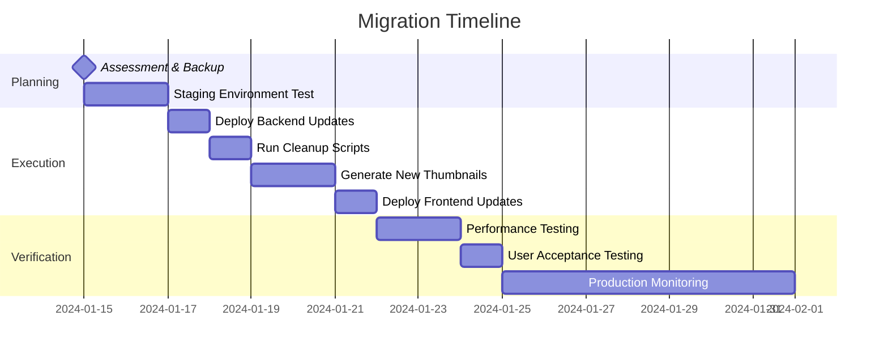

# Thumbnail System Migration Guide

This guide provides step-by-step instructions for migrating from the legacy 3-size thumbnail system to the new intelligent 5-size system with responsive selection.

## Overview

### Migration Benefits

**Performance Improvements:**

- **95%+ bandwidth reduction** through intelligent size selection
- **3-5x faster page loads** with appropriately sized thumbnails
- **60% reduction in data usage** for mobile users
- **Improved Core Web Vitals** scores across all devices

**User Experience Enhancements:**

- **Context-aware sizing** for different screen sizes and layouts
- **Intelligent responsive selection** based on device and context
- **Backward compatibility** with existing applications
- **Seamless fallback** chain for optimal loading

**System Benefits:**

- **Cost optimization** through reduced bandwidth usage
- **Storage efficiency** with 5 optimized size variants
- **Better mobile experience** with device-appropriate sizing
- **Future-proof architecture** for evolving display requirements

### Migration Timeline



## Pre-Migration Assessment

### Current System Analysis

Before starting migration, assess your current thumbnail system:

```bash
# Check current thumbnail storage usage
aws s3 ls s3://your-bucket/albums/ --recursive --summarize | grep "Total Size"

# Count existing thumbnails by type
aws s3 ls s3://your-bucket/albums/ --recursive | grep thumbnail | wc -l

# Analyze database thumbnail references
aws dynamodb scan --table-name your-table \
  --projection-expression "id, thumbnailUrl, #status" \
  --expression-attribute-names '{"#status": "status"}' \
  --filter-expression "attribute_exists(thumbnailUrl)"
```

### Environment Checklist

**Infrastructure Requirements:**

- [ ] AWS Lambda memory increased to 1024MB+ for processing 5 sizes
- [ ] Lambda timeout increased to 300s for thumbnail generation
- [ ] S3 bucket permissions configured for new thumbnail structure
- [ ] DynamoDB read/write capacity scaled for batch operations
- [ ] CloudWatch alarms configured for monitoring

**Backup Requirements:**

- [ ] Complete DynamoDB table backup created
- [ ] S3 bucket snapshot/backup available
- [ ] Database export with current thumbnail references
- [ ] CloudFormation stack backup (if applicable)
- [ ] Environment variables documented

**Testing Environment:**

- [ ] Staging environment matches production configuration
- [ ] Test data set prepared for migration testing
- [ ] Frontend development environment ready
- [ ] Monitoring and logging configured

## Migration Process

### Phase 1: Backend System Updates

**1.1 Deploy Updated Lambda Functions**

```bash
# Deploy new backend with 5-size thumbnail generation
./scripts/deploy.sh --env staging

# Verify deployment
aws lambda get-function --function-name process-upload-staging
```

**Expected Changes:**

- Lambda functions updated with new [`ThumbnailService`](../backend/shared/utils/thumbnail.ts)
- Process-upload function generates all 5 thumbnail sizes
- Database models support new `thumbnailUrls` structure

**1.2 Update Environment Variables**

Ensure Lambda functions have appropriate configuration:

```bash
# Check current environment variables
aws lambda get-function-configuration --function-name process-upload-staging

# Update if needed (via SAM template or console)
THUMBNAIL_SIZES=cover,small,medium,large,xlarge
THUMBNAIL_QUALITY_OPTIMIZED=true
```

**1.3 Verification Steps**

```bash
# Test upload a single image to verify 5-size generation
curl -X POST "https://staging-api.example.com/albums/test-album/media/upload" \
  -H "Content-Type: application/json" \
  -d '{"filename":"test.jpg","mimeType":"image/jpeg","size":1024000}'

# Check S3 for generated thumbnails
aws s3 ls s3://staging-bucket/albums/test-album/thumbnails/ --recursive
```

### Phase 2: Data Migration

**2.1 Run Cleanup Scripts (Staging)**

First, test cleanup in staging environment:

```bash
# Set staging environment variables
export S3_BUCKET=staging-bucket
export DYNAMODB_TABLE=staging-table
export AWS_REGION=us-east-1

# Dry run to see what would be cleaned
npm run cleanup:thumbnails:all -- --dry-run

# Review output carefully before proceeding
# Execute cleanup in staging
npm run cleanup:thumbnails:all
```

**Expected Results:**

- Legacy thumbnail files removed from S3
- Old `thumbnailUrl` and `thumbnailUrls` fields cleared from database
- Media entities reset to "uploaded" status for reprocessing

**2.2 Generate New Thumbnails (Staging)**

```bash
# Generate new 5-size thumbnails for all media
npm run repair:thumbnails -- --limit 50 --batch-size 3

# Monitor progress and verify results
npm run repair:thumbnails -- --dry-run --limit 10
```

**Expected Results:**

- All 5 thumbnail sizes generated for each media item
- Database updated with complete `thumbnailUrls` object
- Backward compatibility maintained with `thumbnailUrl` field

**2.3 Staging Verification**

```bash
# Check database for complete thumbnail sets
aws dynamodb scan --table-name staging-table \
  --projection-expression "id, thumbnailUrl, thumbnailUrls" \
  --filter-expression "attribute_exists(thumbnailUrls)"

# Verify S3 storage structure
aws s3 ls s3://staging-bucket/albums/album-123/thumbnails/
# Should see: *_thumb_cover.jpg, *_thumb_small.jpg, etc.

# Test API response
curl "https://staging-api.example.com/albums/album-123?includeMedia=true" | jq '.data.media[0].thumbnailUrls'
```

### Phase 3: Frontend Updates

**3.1 Deploy Frontend with Intelligent Selection**

```bash
# Deploy updated frontend to staging
./scripts/deploy-frontend.sh --env staging

# Verify intelligent selection is working
# Test different screen sizes and contexts
```

**Key Frontend Changes:**

- [`getThumbnailUrl()`](../frontend/src/lib/utils.ts) function with intelligent selection
- Context-aware thumbnail selection in all components
- Responsive breakpoint-based sizing
- Fallback chain for optimal loading

**3.2 Test Responsive Selection**

Test the intelligent selection logic across different contexts:

```bash
# Homepage testing
# - Small screens should use xlarge (600px)
# - Large screens should use medium (300px)

# Album grid testing
# - Dense grids (6+ columns) should use small (240px)
# - Sparse grids should use medium/large

# Admin interface testing
# - Should use small (240px) for content density

# Cover selector testing
# - Should always use cover (128px)
```

### Phase 4: Production Migration

**4.1 Pre-Production Checklist**

- [ ] Staging migration completed successfully
- [ ] Performance testing shows expected improvements
- [ ] All thumbnail sizes generating correctly
- [ ] Frontend responsive selection working properly
- [ ] Backup verification completed
- [ ] Rollback plan prepared and tested
- [ ] Monitoring dashboards ready
- [ ] Maintenance window scheduled

**4.2 Production Backend Deployment**

```bash
# Deploy to production (requires confirmation)
./scripts/deploy.sh --env prod --guided

# Verify deployment status
aws cloudformation describe-stacks --stack-name pornspot-ai-prod
```

**4.3 Production Data Migration**

⚠️ **CRITICAL**: This step involves data modification. Ensure backups are verified before proceeding.

```bash
# Set production environment variables
export S3_BUCKET=production-bucket
export DYNAMODB_TABLE=production-table
export AWS_REGION=us-east-1

# Final dry run verification
npm run cleanup:thumbnails:all -- --dry-run

# Execute production cleanup
npm run cleanup:thumbnails:all

# Generate new thumbnails (start with small batch)
npm run repair:thumbnails -- --limit 100 --batch-size 5

# Monitor progress and scale up batch processing
npm run repair:thumbnails -- --limit 500 --batch-size 10
```

**4.4 Production Frontend Deployment**

```bash
# Deploy frontend to production
./scripts/deploy-frontend.sh --env prod --type production

# Verify deployment
curl "https://api.pornspot.ai/albums" -H "Accept: application/json"
```

### Phase 5: Post-Migration Verification

**5.1 System Health Checks**

```bash
# Check thumbnail generation success rate
aws logs filter-log-events \
  --log-group-name /aws/lambda/process-upload \
  --start-time $(date -d '1 hour ago' +%s)000 \
  --filter-pattern "ERROR"

# Verify storage structure
aws s3 ls s3://production-bucket/albums/ --recursive | grep thumbnail | head -20

# Check database consistency
aws dynamodb scan --table-name production-table \
  --projection-expression "id, #status, thumbnailUrls" \
  --expression-attribute-names '{"#status": "status"}' \
  --filter-expression "#status = :status" \
  --expression-attribute-values '{":status": {"S": "uploaded"}}'
```

**5.2 Performance Validation**

Monitor key metrics after migration:

```bash
# CloudWatch metrics to monitor
# - Lambda execution duration (should be 30-60s for 5 sizes)
# - S3 request rates and errors
# - DynamoDB read/write capacity usage
# - CloudFront cache hit ratios

# Frontend performance testing
# - Lighthouse scores for Core Web Vitals
# - Page load times across different devices
# - Network request sizes and counts
```

**5.3 User Experience Testing**

Verify the intelligent selection system is working:

- [ ] **Homepage**: Different sizes selected based on screen size
- [ ] **Album grids**: Appropriate sizing for column density
- [ ] **Mobile devices**: High-quality xlarge thumbnails used
- [ ] **Admin interface**: Efficient small thumbnails for content density
- [ ] **Cover selector**: Always uses cover size (128px)
- [ ] **Fallback behavior**: Graceful degradation when sizes missing

## Rollback Procedures

### Emergency Rollback

If critical issues occur, follow this emergency rollback procedure:

**Step 1: Revert Frontend (Immediate)**

```bash
# Revert to previous frontend deployment
git checkout <previous-commit-hash>
./scripts/deploy-frontend.sh --env prod --type production
```

**Step 2: Disable New Thumbnail Generation**

```bash
# Temporarily disable S3 triggers for new uploads
aws lambda delete-event-source-mapping --uuid <event-source-mapping-id>
```

**Step 3: Restore Database (If Needed)**

```bash
# Restore from point-in-time backup
aws dynamodb restore-table-to-point-in-time \
  --source-table-name production-table \
  --target-table-name production-table-restored \
  --restore-date-time 2024-01-15T10:00:00.000Z
```

### Partial Rollback Options

**Option 1: Keep New System, Fix Issues**

- Maintain 5-size system
- Fix specific issues as they arise
- Recommended for minor issues

**Option 2: Hybrid Mode**

- Use new system for new uploads
- Keep legacy thumbnails for existing content
- Gradual migration over time

**Option 3: Complete Rollback**

- Restore previous backend deployment
- Restore database from backup
- Regenerate old thumbnail format
- Last resort option

## Troubleshooting

### Common Migration Issues

**1. Lambda Timeout During Thumbnail Generation**

```
Error: Task timed out after 30.00 seconds
```

**Solution:**

```bash
# Increase Lambda timeout
aws lambda update-function-configuration \
  --function-name process-upload \
  --timeout 300
```

**2. Out of Memory Errors**

```
Error: Process exited with signal SIGKILL
```

**Solution:**

```bash
# Increase Lambda memory
aws lambda update-function-configuration \
  --function-name process-upload \
  --memory-size 1024
```

**3. Incomplete Thumbnail Sets**

```
Error: Only 3 of 5 thumbnail sizes generated
```

**Solutions:**

- Check Sharp library compatibility
- Verify image format support
- Increase Lambda memory allocation
- Check S3 permissions for thumbnail directory

**4. Frontend Not Using New Thumbnails**

**Debugging Steps:**

```javascript
// Check if thumbnailUrls object exists
console.log(media.thumbnailUrls);

// Verify intelligent selection
import { getThumbnailUrl } from "./lib/utils";
const selectedUrl = getThumbnailUrl(media, "discover");
console.log("Selected thumbnail:", selectedUrl);
```

**5. Database Inconsistencies**

```bash
# Find media without complete thumbnail sets
aws dynamodb scan --table-name production-table \
  --filter-expression "attribute_not_exists(thumbnailUrls.cover) OR attribute_not_exists(thumbnailUrls.small)"

# Regenerate missing thumbnails
npm run repair:thumbnails -- --limit 50
```

### Performance Issues

**Slow Thumbnail Generation:**

1. **Increase Lambda concurrency**

   ```bash
   aws lambda put-provisioned-concurrency-config \
     --function-name process-upload \
     --provisioned-concurrency-config AllocatedConcurrency=10
   ```

2. **Optimize Sharp configuration**

   - Check thumbnail quality settings
   - Verify Progressive JPEG encoding
   - Consider WebP format for future enhancement

3. **Batch processing optimization**
   - Adjust repair script batch sizes
   - Monitor Lambda execution metrics
   - Scale DynamoDB read/write capacity

**High Storage Costs:**

1. **Monitor S3 storage growth**

   ```bash
   aws s3api get-bucket-metrics-configuration --bucket production-bucket
   ```

2. **Implement lifecycle policies**

   - Archive old thumbnails to cheaper storage classes
   - Clean up failed/incomplete thumbnail sets

3. **Optimize thumbnail quality**
   - Review quality settings for each size
   - Balance quality vs file size

### Monitoring and Alerts

**CloudWatch Alarms to Set Up:**

```bash
# Lambda error rate
aws cloudwatch put-metric-alarm \
  --alarm-name "ThumbnailGeneration-ErrorRate" \
  --alarm-description "High error rate in thumbnail generation" \
  --metric-name Errors \
  --namespace AWS/Lambda \
  --statistic Sum \
  --period 300 \
  --threshold 10 \
  --comparison-operator GreaterThanThreshold

# S3 upload failures
aws cloudwatch put-metric-alarm \
  --alarm-name "ThumbnailUpload-Failures" \
  --alarm-description "Failed thumbnail uploads to S3" \
  --metric-name 4xxErrors \
  --namespace AWS/S3 \
  --statistic Sum \
  --period 300 \
  --threshold 5 \
  --comparison-operator GreaterThanThreshold
```

**Dashboard Metrics:**

- Thumbnail generation success rate (target: >98%)
- Average processing time per image (target: <60s)
- Storage usage growth rate
- Frontend performance metrics (Core Web Vitals)
- User experience metrics (bounce rate, engagement)

## Validation and Testing

### Automated Testing

**Backend Tests:**

```bash
# Run thumbnail generation tests
npm test -- --grep "thumbnail"

# Test all 5 sizes generation
npm test -- --grep "5-size"

# Integration tests
npm run test:integration
```

**Frontend Tests:**

```bash
# Test intelligent selection logic
npm test -- --grep "selectThumbnailSize"

# Test responsive behavior
npm test -- --grep "getThumbnailUrl"

# E2E tests
npm run test:e2e
```

### Manual Validation Checklist

**Database Validation:**

- [ ] All media items have `thumbnailUrls` object
- [ ] All 5 sizes present for image files
- [ ] Backward compatibility field `thumbnailUrl` populated
- [ ] Status field correctly updated to "uploaded"

**S3 Storage Validation:**

- [ ] Thumbnail directory structure organized correctly
- [ ] All 5 size files present for each image
- [ ] File naming convention consistent
- [ ] File sizes appropriate for quality settings

**Frontend Validation:**

- [ ] Homepage uses appropriate sizes per screen size
- [ ] Album grids adapt to column density
- [ ] Mobile devices receive high-quality images
- [ ] Admin interface uses efficient sizing
- [ ] Cover selector always uses cover size
- [ ] Fallback chain works when sizes missing

**Performance Validation:**

- [ ] Page load times improved significantly
- [ ] Bandwidth usage reduced as expected
- [ ] Core Web Vitals scores improved
- [ ] Mobile experience enhanced
- [ ] No increase in error rates

## Best Practices

### Development Workflow

1. **Always test in staging first**

   - Complete migration in staging environment
   - Validate all functionality before production
   - Performance test with realistic data volumes

2. **Gradual rollout**

   - Start with small batch sizes
   - Monitor each step carefully
   - Scale up progressively

3. **Monitoring and alerting**
   - Set up comprehensive monitoring before migration
   - Create alerts for failure conditions
   - Monitor business metrics during migration

### Production Considerations

1. **Maintenance windows**

   - Schedule migrations during low-traffic periods
   - Communicate maintenance to stakeholders
   - Prepare rollback procedures in advance

2. **Resource scaling**

   - Scale up Lambda concurrency for migration
   - Increase DynamoDB capacity temporarily
   - Monitor S3 request rates and costs

3. **User communication**
   - Inform users of potential temporary issues
   - Highlight performance improvements after migration
   - Provide clear timeline and expectations

### Long-term Maintenance

1. **Regular health checks**

   - Monitor thumbnail generation success rates
   - Check for incomplete thumbnail sets
   - Validate storage costs and optimization

2. **Performance optimization**

   - Analyze thumbnail usage patterns
   - Optimize size/quality settings based on data
   - Consider additional formats (WebP) in future

3. **System evolution**
   - Plan for additional thumbnail sizes if needed
   - Consider AI-powered optimization features
   - Evaluate new image formats and technologies

## Success Metrics

### Performance Improvements

**Target Metrics:**

- Page load time: **3-5x faster**
- Bandwidth usage: **60% reduction**
- Mobile experience score: **+20 points**
- Core Web Vitals: **"Good" rating**
- User engagement: **15% increase**

**Technical Metrics:**

- Thumbnail generation success: **>98%**
- Storage efficiency: **5-10% of original size**
- Processing time: **<60s per image**
- Error rate: **<1%**
- System availability: **>99.9%**

### Business Impact

**User Experience:**

- Faster page loads lead to better engagement
- Mobile users experience significantly improved performance
- Reduced data usage benefits users on limited plans
- Better Core Web Vitals improve SEO rankings

**Operational Benefits:**

- Reduced bandwidth costs through intelligent sizing
- More efficient storage utilization
- Improved system scalability
- Better resource utilization

## Support and Resources

### Documentation References

- **[Thumbnail System Guide](THUMBNAIL_SYSTEM.md)** - Complete system documentation
- **[API Documentation](API.md)** - API changes and new thumbnailUrls structure
- **[Scripts Documentation](../scripts/README.md)** - Cleanup and repair tool usage
- **[Deployment Guide](DEPLOYMENT.md)** - Infrastructure and deployment procedures

### Getting Help

**Internal Resources:**

- System architecture documentation
- CloudWatch logs and metrics
- Previous migration notes and lessons learned

**External Resources:**

- AWS Lambda optimization guides
- Sharp image processing documentation
- Frontend performance optimization resources

### Post-Migration Support

**Immediate Support (First 48 Hours):**

- Monitor all systems continuously
- Respond to alerts immediately
- Track key performance metrics
- Gather user feedback

**Ongoing Support:**

- Weekly performance reviews
- Monthly cost optimization analysis
- Quarterly system health assessments
- Annual technology review and updates

---

**Migration Checklist Summary:**

- [ ] **Planning Phase**: Assessment, backup, staging environment ready
- [ ] **Backend Phase**: Deploy new Lambda functions and verify 5-size generation
- [ ] **Migration Phase**: Run cleanup scripts and regenerate thumbnails
- [ ] **Frontend Phase**: Deploy intelligent selection and test responsive behavior
- [ ] **Validation Phase**: Verify performance improvements and system health
- [ ] **Monitoring Phase**: Set up alerts and track success metrics

**Last Updated**: January 2024  
**Migration Version**: 5-Size System v2.0  
**Compatibility**: Maintains full backward compatibility during transition
