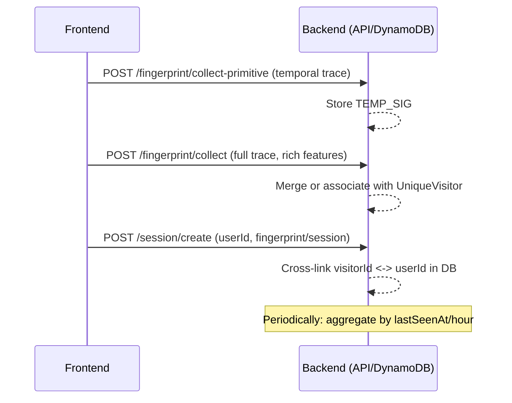

# Unique Visitor Tracking System – Technical Design

## Overview

This system provides robust, privacy-respectful unique visitor tracking across devices, browsers, and user accounts, using composite fingerprinting, behavioral analytics, and account linkage. It enables:

- Accurate unique visitor count (one person = one visitor, even across devices)
- Account sharing detection (one userId → multiple visitorIds)
- Multi-account detection (one visitorId → multiple userIds)
- Flexible time-window aggregation (hourly, daily, rolling)
- Temporal/early-bounce signature tracking for partial fingerprint traces

---

## DynamoDB Schema & Technical Keys

### **Table Structure**

**Partition Key (PK) and Sort Key (SK):**

- **UniqueVisitor**
  - `PK`: `VISITOR#${visitorId}`
  - `SK`: `PROFILE`
- **VisitSession**
  - `PK`: `VISITOR#${visitorId}`
  - `SK`: `SESSION#${sessionId}`
- **UserAccount Link**
  - `PK`: `USER#${userId}`
  - `SK`: `VISITOR#${visitorId}`
- **FingerprintEntity**
  - `PK`: `FINGERPRINT#${fingerprintHash}`
  - `SK`: `METADATA`

**Secondary Index Examples:**

- `GSI1PK`: `USER#${userId}` (to quickly find all visitorIds/account links)
- `GSI2PK`: `FINGERPRINT#${fingerprintHash}`
- `GSI3PK`: `TEMP_SIG#${temporalSignatureId}` (for tracking early bounces/incomplete fingerprints)

### **Temporal (Early Bounce) Signature**

- **Purpose:** If a user leaves before a full trace is collected, store a "temporal signature" entry in DynamoDB.
- `PK`: `TEMP_SIG#${temporalSigHash}`
- `SK`: `INIT`
- Stores: partial trace, timestamp, IP, UA, and possible linkage evidence
- If a subsequent session arrives with the same partial trace, can be linked/merged to a visitor cluster.

---

## Function Flow: Frontend to Backend

### 1. **Primitive Trace Collection**

- On page load, frontend immediately gathers the fastest-available fingerprint properties (CSS, canvas, UA, screen, etc.), hashes them, and sends as a "temporal signature" to `/fingerprint/collect-primitive`.
- DynamoDB stores this with a TEMP_SIG PK/SK and timestamp.

### 2. **Full Trace Collection**

- Meanwhile, frontend continues collecting advanced and behavioral features.
- When ready (typically within 1–3 seconds), sends the full fingerprint and behavioral payload to `/fingerprint/collect`.
- Backend merges with any in-progress temporal signature (if still relevant), or clusters into/associates with an existing UniqueVisitor.
- Provides the canonical `visitorId` to the client.

### 3. **Session and User Linkage**

- On login or session event, client calls `/session/create` with fingerprint and (if available) userId.
- Backend links `visitorId` to `userId` (recorded in both the visitor cluster and in the USER# PK), updates statistics, and supports account sharing/multi-account logic.

### 4. **Hourly/Periodic Analytics**

- A scheduled backend job, or API endpoint, aggregates all UniqueVisitor records with `lastSeenAt` in the past hour.
- Counts distinct visitorIds, userIds, and flags overlaps/shared accounts.

#### **Flowchart**



---

## **Composite VisitorId & UserId Clustering**

- Each UniqueVisitor has:

  - `visitorId` (stable)
  - `associatedFingerprints` (all hashes over time)
  - `linkedUserIds` (all user accounts seen for this cluster)
  - `hourlyVisits`, `dailyVisits` (windowed analytics)
  - `temporalSignatures` (array of PKs for temporal bounces in past N minutes)

- Each UserAccount can be associated with multiple visitors if account sharing detected.

- Temporal signatures act as "pre-sessions"; when a full trace for the same device comes in, the system merges the two.

---

## **Analytics with Partial & Full Traces**

- When aggregating, count both `UniqueVisitor` and temporal signatures separately.
- Unify counts when/if later merged.
- For hourly reporting: query `UniqueVisitor` and `TEMP_SIG` entries with recent timestamps, deduplicate/cluster as candidate unique visitors.

---

## **Handling Edge Cases**

- Multiple userIds with one visitorId (multi-account user): show as single visitor, multiple accounts.
- One userId with multiple visitorIds (shared account): flag for possible sharing.
- Fast-bounce: user leaves before full trace—track as temporal signature; may merge if user returns or converts to full trace later.

---

## **Security & Privacy**

- Do not expose mapping of fingerprints, user accounts, or temporal signatures externally.
- Enforce GDPR/data removal requirements—allow for deletion of a visitor/account link across all relevant PK/SK entries.
- Store only minimal data in temporal signatures (e.g., non-PII hash).

---

## **Example DynamoDB Items**

```
PK='VISITOR#abc', SK='PROFILE'
PK='VISITOR#abc', SK='SESSION#sessionid'
PK='USER#user1', SK='VISITOR#abc'
PK='TEMP_SIG#def', SK='INIT'
```

---

## **Summary**

This design enables:

- Reliable unique visitor analytics even with early-bounce drop-offs
- Powerful cross-device and cross-account clustering
- Flexible, performant, and future-proof DynamoDB queries for product, marketing, and security/abuse analysis
