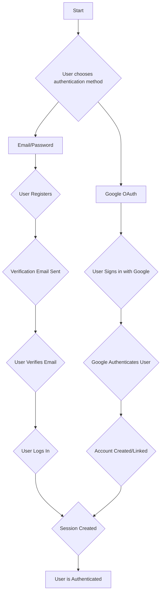

# User Authentication

This document provides a comprehensive overview of the user authentication and session management system for the PornSpot.ai application.

## Authentication Flow

The user authentication system supports both email/password registration and Google OAuth.

## Email/Password Authentication

### 1. **Registration**

- **Endpoint**: `POST /user/auth/register`
- **Handler**: [`backend/functions/user/auth/register.ts`](../backend/functions/user/auth/register.ts)
- **Process**:
  1.  The user provides an email, password, and required username.
  2.  The system validates the email format, password strength, and username format.
  3.  The system checks that the username is unique across all users.
  4.  A new user is created in the database with `isEmailVerified` set to `false`.
  5.  A verification token is generated and sent to the user's email.

### 2. **Username Availability Check**

- **Endpoint**: `GET /user/auth/check-username?username={username}` or `POST /user/auth/check-username`
- **Handler**: [`backend/functions/user/auth/check-username.ts`](../backend/functions/user/auth/check-username.ts)
- **Process**:
  1.  The user provides a username to check for availability.
  2.  The system validates the username format (minimum 3 characters, alphanumeric with underscores/hyphens allowed).
  3.  The system checks if the username is already taken by querying the GSI3 index.
  4.  Returns availability status with appropriate message.
- **Usage**: This endpoint is designed for real-time username validation during registration with debouncing support.

### 3. **Email Verification**

- **Endpoint**: `GET /user/auth/verify-email`
- **Handler**: [`backend/functions/user/auth/verify-email.ts`](../backend/functions/user/auth/verify-email.ts)
- **Process**:
  1.  The user clicks the verification link in the email, which contains a verification token.
  2.  The system validates the token.
  3.  If the token is valid, the user's `isEmailVerified` status is set to `true`.
  4.  The verification token is deleted from the database.
  5.  A welcome email is sent to the user.

### 4. **Login**

- **Endpoint**: `POST /user/auth/login`
- **Handler**: [`backend/functions/user/auth/login.ts`](../backend/functions/user/auth/login.ts)
- **Process**:
  1.  The user provides their email and password.
  2.  The system checks if the user exists and if the email is verified.
  3.  The provided password is compared with the hashed password in the database.
  4.  If the credentials are valid, a new session is created and a session cookie is returned.

## Google OAuth 2.0 Authentication

### 1. **OAuth Flow**

- **Endpoint**: `GET /auth/oauth/callback`
- **Handler**: [`backend/functions/user/auth/oauth-google.ts`](../backend/functions/user/auth/oauth-google.ts)
- **Process**:
  1.  The user clicks the "Sign in with Google" button on the frontend.
  2.  The user is redirected to Google's authentication page.
  3.  After successful authentication, Google redirects the user back to the application's OAuth callback endpoint with an authorization code.
  4.  The backend exchanges the authorization code for an ID token and an access token.
  5.  The ID token is verified, and the user's Google profile information is extracted.
  6.  A new user is created or linked to an existing account based on the Google ID.
  7.  A new session is created, and the user is redirected to the frontend.

### 2. **Environment Variables**

The Google OAuth integration requires the following environment variables:

- `GOOGLE_CLIENT_ID`: Your Google application's client ID.
- `GOOGLE_CLIENT_SECRET`: Your Google application's client secret (should be stored securely, e.g., in AWS Parameter Store).
- `FRONTEND_BASE_URL`: The base URL of your frontend application.

## Session Management

### Session Creation

- A new session is created upon successful login or OAuth authentication.
- A session is stored as a `UserSessionEntity` in the DynamoDB table.
- A secure, HTTP-only session cookie is set in the user's browser. The session duration is 30 days.

### Session Validation

- **Authorizer**: [`backend/functions/user/auth/authorizer.ts`](../backend/functions/user/auth/authorizer.ts)
- **Process**:
  1.  For each request to a protected endpoint, a Lambda authorizer is invoked.
  2.  The authorizer checks for the session cookie in the request headers.
  3.  The session ID is extracted from the cookie and used to retrieve the session from the database.
  4.  If the session is valid and not expired, the authorizer generates an IAM policy that allows the request to proceed.
  5.  The authorizer also passes user context (e.g., `userId`, `email`) to the downstream Lambda function.

### Session Expiration and Cleanup

- Sessions expire after 30 days of inactivity.
- The `cleanupExpiredUserSessions` function in [`backend/shared/utils/dynamodb.ts`](../backend/shared/utils/dynamodb.ts) is responsible for deleting expired sessions from the database. This is typically run as a scheduled task.

## Security Considerations

- **Password Hashing**: Passwords are hashed using `bcrypt` with a salt.
- **CSRF Protection**: The Google OAuth flow uses a `state` parameter to protect against Cross-Site Request Forgery (CSRF) attacks.
- **Secure Cookies**: Session cookies are configured as HTTP-only, secure, and `SameSite=Strict`.
- **Timing Attacks**: The login endpoint includes a delay to prevent timing attacks when a user does not exist.
